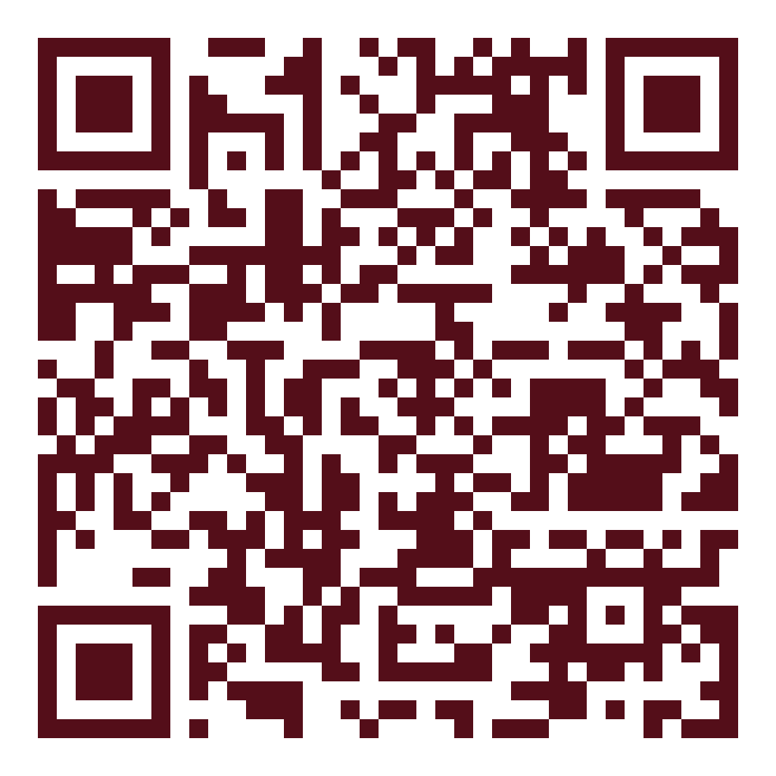

# ジム掲示用ポスター（A4・1枚）

「できたのかけら」ワークショップの告知です。ジムに貼る前提で作っています。

| ファイル | 中身 |
|---|---|
| `seminar-poster.pdf` | 印刷用（A4・1ページ） |
| `poster.html` | 原稿。文言を直すときはこちら |
| `coach.jpg` | しおりんさんの写真（チラシと同じもの） |

## ⚠ まだ入っていないものが2つあります

**このまま印刷しないでください。** 次の2つが仮の状態です。

| 場所 | 今の状態 | 入れるもの |
|---|---|---|
| クーポンコード | `【クーポンコード】` | 実際のコード文字列 |
| QRコード | 点線の枠 | 申し込みページのURLから作ったQR |

### 直し方

`poster.html` の下のほうにある、この行のコードを書き換えます。

```html
<p class="v">【クーポンコード】</p>
```

QRは、申し込みURLが決まったらこのコマンドで作れます。

```sh
python3 -c "import segno; segno.make('申込URL', error='h').save('seminar/poster/qr.png', scale=20, border=2, dark='#540E19', light='#FFFFFF')"
```

そのあと `poster.html` の QR の枠を、次のように差し替えます。

```html
<div class="qr__box"></div>
```

最後にPDFを作り直します。

```sh
cd seminar/poster
python3 build-pdf.py
```

`build-pdf.py` は本文の高さをmmで表示します。**297.1 と出ればA4 1ページに
収まっています。** これより大きい数字が出たら、文字数を減らしてください。

## 開催情報（ポスターに入れてあるもの）

| | |
|---|---|
| 日時 | 2026年9月26日（土）9:30–11:00（90分） |
| 形式 | Zoom（オンライン） |
| 参加費 | 3,300円 → クーポンコードで無料 |
| 特典 | ワークシート2枚（`../worksheets/`） |

**定員は書いていません。** 「定員になり次第、受付を終了します」とだけ
入れてあります。人数を出したい場合は `apply__n` の行に足してください。

## 構成の意図

ジムの掲示は**立ち止まって3秒**で判断されます。その3秒で伝わるように、
上から順にこう並べています。

1. **誰に向けた話か**（練習では挙がるのに、試合で取り切れないパワーリフターへ）
2. **無料であること**（右上の丸。3,300円→0円と明記）
3. **いつ・どこで・いくら**（3つに区切った横帯）
4. **自分のことだと分かる6項目**（ここで止まった人が申し込みます）
5. **当日やること3つ**（何をするか分からない会には申し込めません）
6. **特典**
7. **誰がやるのか**
8. **申し込み方法**

パワーリフティング向けに、症状を競技の言葉にしてあります。
「3本目が、毎回こわい」は、この競技の人にしか書けない一行です。

## 印刷について

- **A4・等倍（100%）で印刷**してください。「フチなし」は使わないでください
- 白黒でも読めますが、右上の「無料」の丸が弱くなります。**できればカラー**で
- ジムの掲示板なら、A4のままで十分読めます。A3に拡大するとさらに目立ちます
